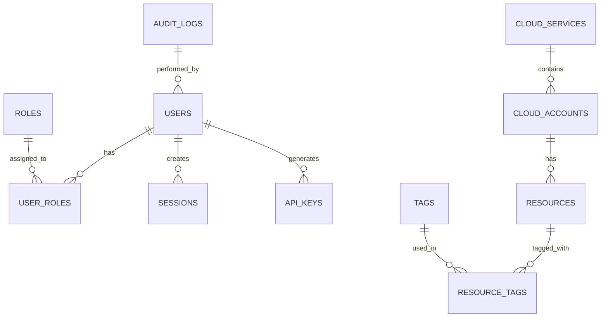

# ExtBridge データ設計書

## 1. はじめに

### 1.1 目的
本ドキュメントは、ExtBridgeシステムにおけるデータベースの論理設計と物理設計について定義することを目的とします。

### 1.2 対象範囲
- データベースの論理設計（エンティティ、リレーションシップ）
- テーブル定義
- インデックス設計
- パーティショニング設計
- バックアップ・リカバリ方針

## 2. データベース概要

### 2.1 データベース管理システム（DBMS）
- **種別**: リレーショナルデータベース
- **製品**: Amazon Aurora PostgreSQL 互換エディション
- **バージョン**: PostgreSQL 14.5
- **インスタンスタイプ**: db.r6g.large（開発環境）、db.r6g.2xlarge（本番環境）

### 2.2 データベース構成
- **マルチAZ構成**: 可用性のためマルチAZ構成を採用
- **リードレプリカ**: 本番環境では2つのリードレプリカを構成
- **バックアップ**: 自動バックアップ（35日間保持）＋ スナップショット

## 3. 論理データモデル

### 3.1 エンティティリレーションシップ図


## 4. テーブル定義

### 4.1 ユーザー管理関連

#### 4.1.1 users テーブル
| カラム名 | データ型 | NULL | デフォルト | 説明 |
|---------|---------|------|------------|------|
| id | UUID | NOT NULL | gen_random_uuid() | 主キー |
| email | VARCHAR(255) | NOT NULL | - | メールアドレス（ログインID） |
| password_hash | VARCHAR(255) | NOT NULL | - | パスワードハッシュ |
| first_name | VARCHAR(100) | NOT NULL | - | 名 |
| last_name | VARCHAR(100) | NOT NULL | - | 姓 |
| is_active | BOOLEAN | NOT NULL | true | アカウント有効フラグ |
| last_login_at | TIMESTAMPTZ | NULL | - | 最終ログイン日時 |
| mfa_enabled | BOOLEAN | NOT NULL | false | 多要素認証有効フラグ |
| created_at | TIMESTAMPTZ | NOT NULL | CURRENT_TIMESTAMP | 作成日時 |
| updated_at | TIMESTAMPTZ | NOT NULL | CURRENT_TIMESTAMP | 更新日時 |

**制約**:
- 主キー: `id`
- ユニーク制約: `email`

**インデックス**:
- `idx_users_email`: `email` カラムへのB-treeインデックス
- `idx_users_name`: `last_name`, `first_name` カラムへの複合B-treeインデックス

#### 4.1.2 roles テーブル
| カラム名 | データ型 | NULL | デフォルト | 説明 |
|---------|---------|------|------------|------|
| id | SERIAL | NOT NULL | - | 主キー |
| name | VARCHAR(50) | NOT NULL | - | ロール名 |
| description | TEXT | NULL | - | 説明 |
| created_at | TIMESTAMPTZ | NOT NULL | CURRENT_TIMESTAMP | 作成日時 |
| updated_at | TIMESTAMPTZ | NOT NULL | CURRENT_TIMESTAMP | 更新日時 |

**制約**:
- 主キー: `id`
- ユニーク制約: `name`

#### 4.1.3 user_roles テーブル
| カラム名 | データ型 | NULL | デフォルト | 説明 |
|---------|---------|------|------------|------|
| user_id | UUID | NOT NULL | - | ユーザーID（外部キー） |
| role_id | INTEGER | NOT NULL | - | ロールID（外部キー） |
| created_at | TIMESTAMPTZ | NOT NULL | CURRENT_TIMESTAMP | 作成日時 |

**制約**:
- 主キー: `user_id`, `role_id`
- 外部キー: `user_id` 参照 `users(id)` ON DELETE CASCADE
- 外部キー: `role_id` 参照 `roles(id)` ON DELETE CASCADE

### 4.2 クラウドサービス管理関連

#### 4.2.1 cloud_services テーブル
| カラム名 | データ型 | NULL | デフォルト | 説明 |
|---------|---------|------|------------|------|
| id | SERIAL | NOT NULL | - | 主キー |
| name | VARCHAR(100) | NOT NULL | - | サービス名（AWS, GCP, Azure等） |
| display_name | VARCHAR(100) | NOT NULL | - | 表示名 |
| description | TEXT | NULL | - | 説明 |
| icon_url | VARCHAR(255) | NULL | - | アイコンURL |
| is_active | BOOLEAN | NOT NULL | true | 有効フラグ |
| created_at | TIMESTAMPTZ | NOT NULL | CURRENT_TIMESTAMP | 作成日時 |
| updated_at | TIMESTAMPTZ | NOT NULL | CURRENT_TIMESTAMP | 更新日時 |

**制約**:
- 主キー: `id`
- ユニーク制約: `name`

#### 4.2.2 cloud_accounts テーブル
| カラム名 | データ型 | NULL | デフォルト | 説明 |
|---------|---------|------|------------|------|
| id | UUID | NOT NULL | gen_random_uuid() | 主キー |
| cloud_service_id | INTEGER | NOT NULL | - | クラウドサービスID |
| account_name | VARCHAR(100) | NOT NULL | - | アカウント名 |
| account_id | VARCHAR(100) | NOT NULL | - | クラウドアカウントID |
| region | VARCHAR(50) | NOT NULL | - | リージョン |
| credentials | JSONB | NOT NULL | - | 認証情報（暗号化） |
| is_active | BOOLEAN | NOT NULL | true | 有効フラグ |
| last_synced_at | TIMESTAMPTZ | NULL | - | 最終同期日時 |
| created_at | TIMESTAMPTZ | NOT NULL | CURRENT_TIMESTAMP | 作成日時 |
| updated_at | TIMESTAMPTZ | NOT NULL | CURRENT_TIMESTAMP | 更新日時 |
| created_by | UUID | NOT NULL | - | 作成者 |
| updated_by | UUID | NOT NULL | - | 更新者 |

**制約**:
- 主キー: `id`
- 外部キー: `cloud_service_id` 参照 `cloud_services(id)`
- 外部キー: `created_by` 参照 `users(id)`
- 外部キー: `updated_by` 参照 `users(id)`
- ユニーク制約: `cloud_service_id`, `account_id`

**インデックス**:
- `idx_cloud_accounts_cloud_service_id`: `cloud_service_id` カラムへのB-treeインデックス
- `idx_cloud_accounts_account_id`: `account_id` カラムへのB-treeインデックス

### 4.3 リソース管理関連

#### 4.3.1 resources テーブル
| カラム名 | データ型 | NULL | デフォルト | 説明 |
|---------|---------|------|------------|------|
| id | UUID | NOT NULL | gen_random_uuid() | 主キー |
| cloud_account_id | UUID | NOT NULL | - | クラウドアカウントID |
| resource_type | VARCHAR(100) | NOT NULL | - | リソースタイプ |
| resource_id | VARCHAR(255) | NOT NULL | - | リソースID |
| name | VARCHAR(255) | NULL | - | リソース名 |
| status | VARCHAR(50) | NOT NULL | - | ステータス |
| region | VARCHAR(50) | NULL | - | リージョン |
| metadata | JSONB | NULL | - | メタデータ |
| created_at | TIMESTAMPTZ | NOT NULL | CURRENT_TIMESTAMP | 作成日時 |
| updated_at | TIMESTAMPTZ | NOT NULL | CURRENT_TIMESTAMP | 更新日時 |
| last_synced_at | TIMESTAMPTZ | NULL | - | 最終同期日時 |

**制約**:
- 主キー: `id`
- 外部キー: `cloud_account_id` 参照 `cloud_accounts(id)` ON DELETE CASCADE
- ユニーク制約: `cloud_account_id`, `resource_type`, `resource_id`

**インデックス**:
- `idx_resources_cloud_account_id`: `cloud_account_id` カラムへのB-treeインデックス
- `idx_resources_resource_type`: `resource_type` カラムへのB-treeインデックス
- `idx_resources_resource_id`: `resource_id` カラムへのB-treeインデックス
- `idx_resources_status`: `status` カラムへのB-treeインデックス

#### 4.3.2 tags テーブル
| カラム名 | データ型 | NULL | デフォルト | 説明 |
|---------|---------|------|------------|------|
| id | SERIAL | NOT NULL | - | 主キー |
| key | VARCHAR(100) | NOT NULL | - | タグキー |
| value | TEXT | NOT NULL | - | タグ値 |
| created_at | TIMESTAMPTZ | NOT NULL | CURRENT_TIMESTAMP | 作成日時 |
| updated_at | TIMESTAMPTZ | NOT NULL | CURRENT_TIMESTAMP | 更新日時 |

**制約**:
- 主キー: `id`
- ユニーク制約: `key`, `value`

#### 4.3.3 resource_tags テーブル
| カラム名 | データ型 | NULL | デフォルト | 説明 |
|---------|---------|------|------------|------|
| resource_id | UUID | NOT NULL | - | リソースID |
| tag_id | INTEGER | NOT NULL | - | タグID |
| created_at | TIMESTAMPTZ | NOT NULL | CURRENT_TIMESTAMP | 作成日時 |

**制約**:
- 主キー: `resource_id`, `tag_id`
- 外部キー: `resource_id` 参照 `resources(id)` ON DELETE CASCADE
- 外部キー: `tag_id` 参照 `tags(id)` ON DELETE CASCADE

### 4.4 監査ログ関連

#### 4.4.1 audit_logs テーブル
| カラム名 | データ型 | NULL | デフォルト | 説明 |
|---------|---------|------|------------|------|
| id | BIGSERIAL | NOT NULL | - | 主キー |
| user_id | UUID | NULL | - | ユーザーID |
| action | VARCHAR(50) | NOT NULL | - | アクション種別 |
| resource_type | VARCHAR(100) | NULL | - | リソースタイプ |
| resource_id | VARCHAR(255) | NULL | - | リソースID |
| status | VARCHAR(50) | NOT NULL | - | ステータス |
| ip_address | INET | NULL | - | IPアドレス |
| user_agent | TEXT | NULL | - | ユーザーエージェント |
| metadata | JSONB | NULL | - | メタデータ |
| created_at | TIMESTAMPTZ | NOT NULL | CURRENT_TIMESTAMP | 作成日時 |

**制約**:
- 主キー: `id`
- 外部キー: `user_id` 参照 `users(id)` ON DELETE SET NULL

**インデックス**:
- `idx_audit_logs_user_id`: `user_id` カラムへのB-treeインデックス
- `idx_audit_logs_action`: `action` カラムへのB-treeインデックス
- `idx_audit_logs_created_at`: `created_at` カラムへのB-treeインデックス（時系列検索用）

## 5. パーティショニング設計

### 5.1 パーティショニング方針
大量のデータが想定されるテーブルについては、パーティショニングを適用してパフォーマンスと管理性を向上させます。

#### 5.1.1 audit_logs テーブルのパーティショニング
- **パーティションキー**: `created_at`（日付ベース）
- **パーティション方式**: RANGE
- **保持期間**: 1年（12パーティション）
- **パーティション名規則**: `audit_logs_yyyy_mm`

```sql
-- パーティションテーブル作成例
CREATE TABLE audit_logs (
    -- カラム定義は前述の通り
) PARTITION BY RANGE (created_at);

-- 月次パーティション作成
CREATE TABLE audit_logs_2025_03 PARTITION OF audit_logs
    FOR VALUES FROM ('2025-03-01 00:00:00+00') TO ('2025-04-01 00:00:00+00');
```

## 6. バックアップ・リカバリ

### 6.1 バックアップ戦略
- **自動バックアップ**: 1日1回、35日間保持
- **ポイントインタイムリカバリ（PITR）**: 5分間隔でトランザクションログをバックアップ
- **手動スナップショット**: メジャーリリース前などに取得

### 6.2 リカバリ目標
- **目標復旧時点（RPO）**: 5分
- **目標復旧時間（RTO）**: 30分

## 7. セキュリティ

### 7.1 データ暗号化
- **保存時暗号化**: AES-256（AWS KMSマネージドキー）
- **転送中暗号化**: TLS 1.3
- **パスワード**: bcrypt（ソルト+ストレッチング）

### 7.2 アクセス制御
- **最小権限の原則**に基づくロールベースアクセス制御（RBAC）
- データベースユーザーはアプリケーションユーザーと分離
- 本番環境への直接アクセスは制限

## 8. パフォーマンスチューニング

### 8.1 インデックス戦略
- 頻繁に検索条件となるカラムにB-treeインデックスを設定
- 複合インデックスはクエリのWHERE句とORDER BY句を考慮
- 不要なインデックスは定期的に削除

### 8.2 クエリ最適化
- EXPLAIN ANALYZEを使用したクエリパフォーマンス分析
- N+1問題の回避（JOINの適切な使用）
- 遅いクエリの監視と最適化

## 9. 監視・運用

### 9.1 監視項目
- データベース接続数
- クエリ実行時間
- ディスク使用量
- レプリケーション遅延

### 9.2 メンテナンス
- 定期的なVACUUM ANALYZEの実行
- 統計情報の更新
- インデックスの再構築（REINDEX）

## 10. 付録

### 10.1 用語集
- **RPO（Recovery Point Objective）**: 目標復旧時点
- **RTO（Recovery Time Objective）**: 目標復旧時間
- **PITR（Point-In-Time Recovery）**: 特定時点へのリカバリ
- **WAL（Write-Ahead Logging）**: 先行書き込みログ

### 10.2 参考資料
- [PostgreSQL 14 ドキュメント](https://www.postgresql.jp/document/14/html/)
- [Amazon Aurora ユーザーガイド](https://docs.aws.amazon.com/ja_jr/AmazonRDS/latest/AuroraUserGuide/CHAP_AuroraOverview.html)
- [データベース設計のベストプラクティス](https://aws.amazon.com/jp/blogs/database/designing-database-solutions-on-aws/)

---
**文書管理番号**: PL-008  
**版数**: 1.0  
**最終更新日**: 2025-03-22  
**作成者**: データベース設計チーム  
**承認者**: データベース管理者
