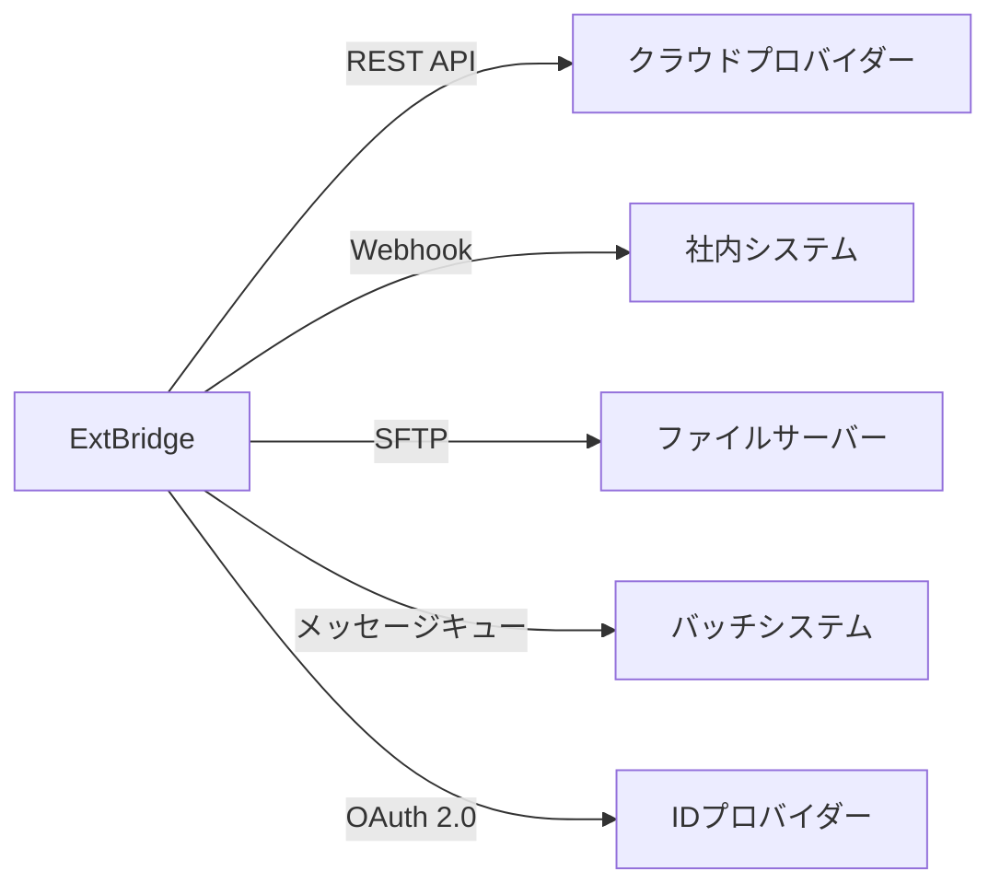
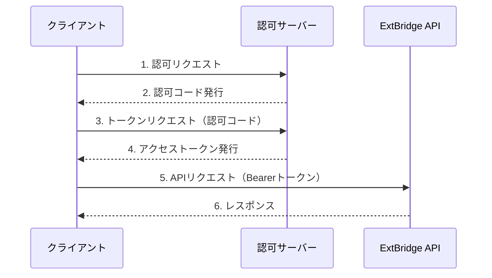

# ExtBridge 外部インターフェース設計書

## 1. はじめに

### 1.1 目的
本ドキュメントは、ExtBridgeシステムと外部システム間のインターフェース仕様を定義し、システム間連携の実装・運用を円滑に行うことを目的とします。

### 1.2 対象範囲
- 外部システムとの連携方式
- API仕様
- ファイル連携仕様
- メッセージング連携仕様
- 認証・認可方式
- エラーハンドリング
- 監視・運用方針

## 2. システム構成

### 2.1 全体構成図


### 2.2 ネットワーク構成
- **DMZ**: 外部公開API、Webhook受信エンドポイント
- **アプリケーション層**: ビジネスロジック、APIゲートウェイ
- **データ層**: データベース、キャッシュサーバー

## 3. 外部システム一覧

### 3.1 連携先システム一覧
| 連携先 | 連携方式 | 認証方式 | データ形式 | 通信プロトコル | 頻度 | 責任部署 |
|-------|---------|----------|------------|----------------|------|----------|
| AWS | REST API | AWS SigV4 | JSON | HTTPS | 随時 | クラウド運用チーム |
| Azure | REST API | OAuth 2.0 | JSON | HTTPS | 随時 | クラウド運用チーム |
| GCP | REST API | API Key | JSON | HTTPS | 随時 | クラウド運用チーム |
| 社内認証システム | OIDC | OAuth 2.0 | JWT | HTTPS | 随時 | 情報システム部 |
| 監視システム | Webhook | API Key | JSON | HTTPS | イベント発生時 | 運用チーム |
| バッチシステム | メッセージキュー | mTLS | Protocol Buffers | AMQP 1.0 | バッチ実行時 | データ基盤チーム |
| ファイルサーバー | SFTP | 公開鍵認証 | CSV/JSON | SFTP | 日次 | データ基盤チーム |

## 4. API仕様

### 4.1 基本仕様
- **APIスタイル**: RESTful API
- **認証方式**: OAuth 2.0 (Bearer Token)
- **データ形式**: JSON
- **文字コード**: UTF-8
- **日時形式**: ISO 8601 (例: 2025-03-22T15:30:00+09:00)
- **タイムゾーン**: JST (Asia/Tokyo)
- **バージョニング**: URLパスベース (例: `/api/v1/resource`)
- **レートリミット**: 1,000リクエスト/分/IP

### 4.2 エンドポイント一覧

#### 4.2.1 リソース管理API

##### リソース一覧取得
```
GET /api/v1/resources
```

**リクエストパラメータ**
| パラメータ名 | 型 | 必須 | 説明 | デフォルト | 例 |
|-------------|----|------|------|------------|-----|
| cloud_provider | string | 任意 | クラウドプロバイダー | - | aws |
| resource_type | string | 任意 | リソースタイプ | - | ec2 |
| region | string | 任意 | リージョン | - | ap-northeast-1 |
| tag_key | string | 任意 | タグキー | - | Environment |
| tag_value | string | 任意 | タグ値 | - | Production |
| page | integer | 任意 | ページ番号 | 1 | 1 |
| per_page | integer | 任意 | 1ページあたりの件数 | 50 | 100 |

**レスポンス例**
```json
{
  "data": [
    {
      "id": "i-0123456789abcdef0",
      "name": "web-server-01",
      "type": "ec2",
      "status": "running",
      "region": "ap-northeast-1",
      "cloud_provider": "aws",
      "created_at": "2025-01-15T10:00:00+09:00",
      "updated_at": "2025-03-20T15:30:00+09:00",
      "tags": [
        {"key": "Environment", "value": "Production"},
        {"key": "Owner", "value": "devops-team"}
      ]
    }
  ],
  "pagination": {
    "total": 1,
    "page": 1,
    "per_page": 50,
    "total_pages": 1
  }
}
```

##### リソース詳細取得
```
GET /api/v1/resources/{resource_id}
```

**パスパラメータ**
| パラメータ名 | 型 | 必須 | 説明 | 例 |
|-------------|----|------|------|-----|
| resource_id | string | 必須 | リソースID | i-0123456789abcdef0 |

**レスポンス例**
```json
{
  "data": {
    "id": "i-0123456789abcdef0",
    "name": "web-server-01",
    "type": "ec2",
    "status": "running",
    "region": "ap-northeast-1",
    "cloud_provider": "aws",
    "instance_type": "t3.medium",
    "private_ip": "10.0.1.10",
    "public_ip": "203.0.113.10",
    "launch_time": "2025-01-15T10:00:00+09:00",
    "created_at": "2025-01-15T10:00:00+09:00",
    "updated_at": "2025-03-20T15:30:00+09:00",
    "tags": [
      {"key": "Environment", "value": "Production"},
      {"key": "Owner", "value": "devops-team"},
      {"key": "Name", "value": "web-server-01"}
    ]
  }
}
```

### 4.3 認証認可

#### 4.3.1 OAuth 2.0 認証フロー


#### 4.3.2 スコープ
| スコープ | 説明 |
|---------|------|
| read:resources | リソースの読み取り |
| write:resources | リソースの作成・更新・削除 |
| read:logs | ログの読み取り |
| admin:all | 全管理権限 |

## 5. ファイル連携仕様

### 5.1 SFTP連携

#### 5.1.1 接続情報
| 項目 | 値 |
|-----|-----|
| ホスト名 | sftp.example.com |
| ポート | 22 |
| ユーザー名 | extbridge_sftp |
| 認証方式 | 公開鍵認証 |
| ホストキー | ssh-rsa AAAAB3N... |
| ディレクトリ | /incoming/extbridge/ |
| ファイル名パターン | `{date:YYYYMMDD}_{type}_{seq:04d}.{ext}` |

#### 5.1.2 ファイル形式例（CSV）
```csv
id,name,type,status,region,created_at,updated_at
i-0123456789abcdef0,web-server-01,ec2,running,ap-northeast-1,2025-01-15T10:00:00+09:00,2025-03-20T15:30:00+09:00
i-0fedcba9876543210,db-server-01,rds,available,ap-northeast-1,2025-01-10T09:15:00+09:00,2025-03-21T10:45:00+09:00
```

#### 5.1.3 ファイル処理フロー
1. ファイル受信
2. ファイルバリデーション
   - フォーマットチェック
   - 必須項目チェック
   - データ型チェック
3. 一時ディレクトリに移動
4. バックアップを取得
5. 本番ディレクトリに移動
6. 処理済みファイルをアーカイブ

## 6. メッセージング連携

### 6.1 メッセージキュー
| 項目 | 値 |
|-----|-----|
| プロトコル | AMQP 1.0 |
| ブローカー | Apache ActiveMQ |
| 認証 | mTLS |
| キュー名 | extbridge.events |
| メッセージ形式 | Protocol Buffers |

### 6.2 メッセージ形式
```protobuf
syntax = "proto3";

package extbridge.events.v1;


message ResourceEvent {
  string event_id = 1;          // イベントID (UUID)
  string event_type = 2;       // イベントタイプ (created/updated/deleted)
  string resource_id = 3;      // リソースID
  string resource_type = 4;     // リソースタイプ
  string cloud_provider = 5;    // クラウドプロバイダー
  string region = 6;            // リージョン
  map<string, string> metadata = 7;  // メタデータ
  string occurred_at = 8;       // 発生日時 (ISO 8601)
}
```

## 7. エラーハンドリング

### 7.1 エラーコード一覧
| HTTPステータス | エラーコード | メッセージ | 説明 |
|--------------|-------------|------------|------|
| 400 | INVALID_PARAMETER | 無効なパラメータです | リクエストパラメータが不正 |
| 401 | UNAUTHORIZED | 認証に失敗しました | 認証情報が不正または不足 |
| 403 | FORBIDDEN | 権限がありません | リソースへのアクセス権限がない |
| 404 | NOT_FOUND | リソースが見つかりません | 指定されたリソースが存在しない |
| 429 | RATE_LIMIT_EXCEEDED | レート制限を超えました | リクエスト数が制限を超過 |
| 500 | INTERNAL_SERVER_ERROR | 内部エラーが発生しました | サーバー内部エラー |
| 503 | SERVICE_UNAVAILABLE | サービスが利用できません | メンテナンス中または過負荷 |

### 7.2 エラーレスポンス形式
```json
{
  "error": {
    "code": "INVALID_PARAMETER",
    "message": "無効なパラメータです",
    "details": [
      {
        "field": "email",
        "message": "有効なメールアドレスを指定してください"
      },
      {
        "field": "password",
        "message": "8文字以上必要です"
      }
    ],
    "request_id": "req_1234567890abcdef",
    "timestamp": "2025-03-22T16:30:45+09:00"
  }
}
```

## 8. 監視・運用

### 8.1 監視項目
| 項目 | 閾値 | アラートレベル | 通知先 |
|-----|------|--------------|--------|
| レスポンスタイム | 平均 500ms 超過 | Warning | Slack #alerts |
| エラーレート | 1% 超過 | Critical | PagerDuty |
| スロークエリ | 5秒以上 | Warning | Slack #alerts |
| 認証エラー | 1分間に10回以上 | Critical | PagerDuty |
| ファイル処理遅延 | 1時間以上 | Warning | Slack #alerts |

### 8.2 ログ出力
- アクセスログ: 全てのAPIリクエスト/レスポンスを記録
- 監査ログ: 重要な操作（作成・更新・削除）を記録
- エラーログ: エラー発生時のスタックトレースを記録
- パフォーマンスログ: 遅いクエリや処理を記録

## 9. セキュリティ

### 9.1 データ保護
- 通信の暗号化: TLS 1.2以上を必須
- 機微データのマスキング: ログやレスポンスからパスワードやトークンなどをマスキング
- データ保持期間: 監査ログは1年間、アクセスログは3ヶ月間保持

### 9.2 アクセス制御
- IP制限: 管理APIは特定のIPアドレスのみ許可
- レートリミット: APIごとにリクエスト数を制限
- 監査証跡: 全ての管理操作を記録

## 10. 付録

### 10.1 用語集
| 用語 | 説明 |
|------|------|
| API | Application Programming Interface |
| REST | Representational State Transfer |
| OAuth | 認可のためのオープンスタンダード |
| JWT | JSON Web Token |
| mTLS | Mutual Transport Layer Security |
| SFTP | SSH File Transfer Protocol |
| AMQP | Advanced Message Queuing Protocol |

### 10.2 参考資料
- [OpenAPI 3.0 仕様](https://swagger.io/specification/)
- [OAuth 2.0 認可フレームワーク](https://tools.ietf.org/html/rfc6749)
- [JWT (JSON Web Token)](https://jwt.io/)
- [Protocol Buffers](https://developers.google.com/protocol-buffers)

---
**文書管理番号**: PL-009  
**版数**: 1.0  
**最終更新日**: 2025-03-22  
**作成者**: システム統合チーム  
**承認者**: システムアーキテクト
